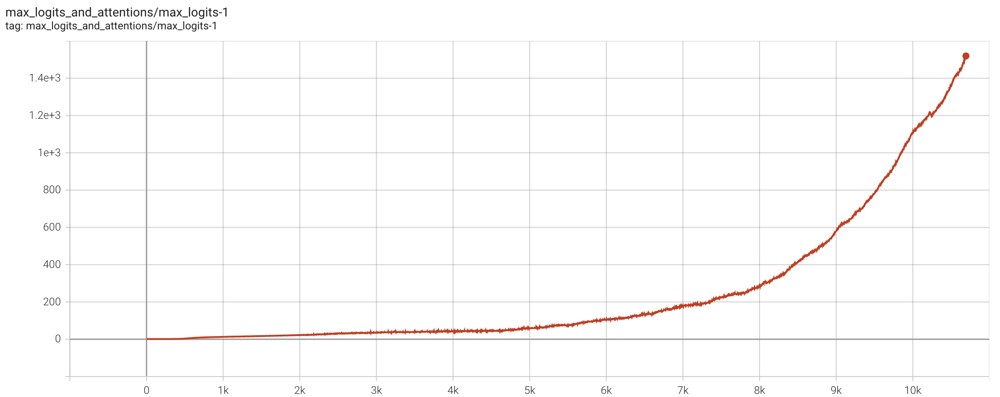
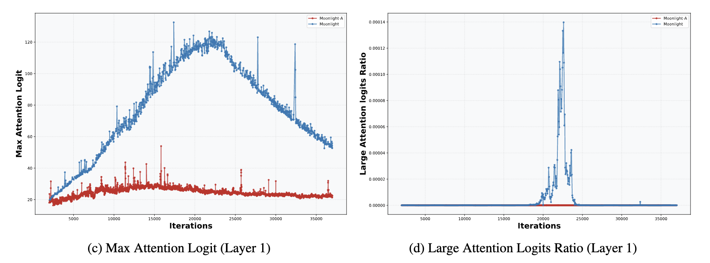
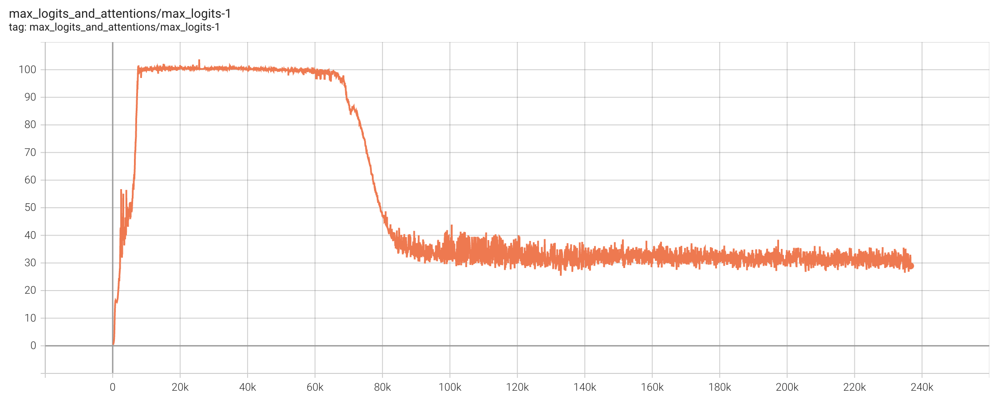
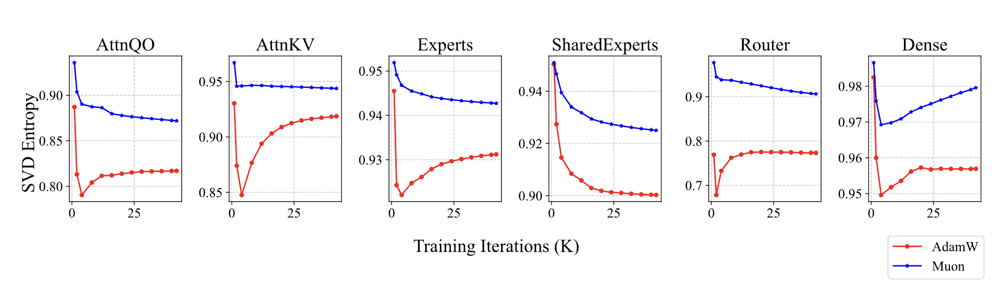

Translated to English. Original can be found here: [QK-Clip：让Muon在Scaleup之路上更进一步](https://muon.ai/blog/qk-clip-taking-muon-one-step-further-on-the-road-to-scale-up)

### Introduction

Four months ago, we released Moonlight, validating the effectiveness of the Muon optimizer on a 16B MoE model. In Moonlight, we confirmed the necessity of adding Weight Decay to Muon and introduced a technique to migrate Adam hyperparameters via Update RMS alignment, enabling Muon’s rapid application in LLM training. However, as we tried to scale Muon to models with over hundreds of billions of parameters, we encountered a new roadblock—**MaxLogit explosion**.

:::{.callout-note collapse="true"}
### Notes

`Update RMS alignment` is a technique that scales the Muon optimizer’s updates to match the Root Mean Square (RMS) magnitude of Adam's updates, enabling a smooth and stable transition between optimizers in large-scale language model training.

In the MuonClip equations, this line reflects the RMS alignment:

$$
\mathbf{O}_t = \text{msign}(\mathbf{M}_t) \times \sqrt{\max(n, m)} \times 0.2
$$

* $msign(M_t)$ gives the momentum direction,
* The multiplier $\sqrt{\max(n, m)} \times 0.2$ is designed to match the RMS of Adam's update — i.e., the average update size.

:::

To address this, we propose a simple yet extremely effective method called **QK‑Clip**. This technique takes a fundamentally principled approach to the MaxLogit phenomenon without sacrificing model performance, and has become a key training innovation in our latest trillion-parameter model, Kimi K2.

### Problem Description

Let’s start with a brief introduction to MaxLogit explosion. Recall the definition of attention:

$$
\mathbf O = \operatorname{softmax}(\mathbf Q\mathbf K^\top)\mathbf V
\tag{1}
$$

Here we omit the scaling factor $1/\sqrt{d}$ since it can be absorbed into $\mathbf Q$,$\mathbf K$. Logits here refer to the pre-softmax attention matrix $\mathbf Q\mathbf K^\top$, and MaxLogit means its maximum absolute entry:

$$
S_{\max} = \|\mathbf Q\mathbf K^\top\|_\infty = \max_{ij} |q_i \cdot k_j|
\tag{2}
$$

The max is also taken across the batch, producing a scalar. MaxLogit explosion refers to $S_{\max}$ steadily increasing during training—with linear or superlinear growth—and remaining unstable for long periods.

:::{.callout-important collapse="true"}
### Side note on inf norm

In theory inf norm is defined as,
$$
\|A\|_\infty = \max_{i} \sum_{j} |a_{ij}|
$$

which is the max of the sum of the absolute values of the rows of $A$ but here its being used as a `max` norm which is denoted as

$$
\|A\|_{max} = \max_{ij} |a_{ij}|
$$

:::

**MaxLogit** is effectively an outlier metric—its explosion signals uncontrollable outlier values. Specifically,

$$
|q_i \cdot k_j| \le \|q_i\|\,\|k_j\| = \|x_iW_q\|\,\|x_jW_k\|
\le \|x_i\|\,\|x_j\|\,\|W_q\|\,\|W_k\|
\tag{3}
$$

Since x is typically RMSNormed, $\|x_i\|\|x_j\|$ won’t explode. Thus, MaxLogit explosion implies the spectral norms $\|W_q\|$ and $\|W_k\|$ risk unbounded growth—clearly undesirable.

Although large logits become bounded by softmax and usually only waste an attention head, in the worst case they can cause gradient spikes or training collapse. So preventing MaxLogit explosion is critical.

:::{.callout-note collapse="true"}
### Notes

$$
|q_i \cdot k_j| \le \|q_i\|\,\|k_j\|
$$

is called the **Cauchy–Schwarz inequality**. It expresses that the dot product of two vectors is at most the product of their magnitudes.

:::

### Existing Attempts

In our previous post [“Muon Sequel: Why We Chose to Use Muon?”](https://kexue.fm/archives/10739) we noted that Weight Decay helps curtail MaxLogit explosion. As a result, small models seldom encounter it, and even the 16B Moonlight model experienced MaxLogit rising to ~120 before subsiding.

However, MaxLogit explosion primarily arises in massively scaled models. With increased size comes more instability, and Weight Decay alone proves insufficient. Adding weight decay at this point can help with control the parameter growth or prevent explosion, but it also leads to a significant drop in performance — so this path doesn't work. Another idea is applying a softcap to logits:

$$
\mathbf O = \operatorname{softmax}(\operatorname{softcap}(\mathbf Q\mathbf K^\top; \tau))\mathbf V
\tag{4}
$$

where $\operatorname{softcap}(x;\tau)=\tau\tanh(x/\tau)$, introduced by Google’s Gemma2. Since $tanh$ is bounded, softcap naturally ensures that the logits after softcap are also bounded. However, it does not guarantee that the logits before softcap are bounded (we’ve verified this ourselves), so in reality, softcap just transforms one problem into another—it doesn’t truly solve it.

Aware of this, Gemma3 abandoned softcap in favor of QK‑Norm:

$$
\mathbf O = \operatorname{softmax}(\tilde Q\,\tilde K^\top)\mathbf V,
\quad \tilde Q, \tilde K = \operatorname{RMSNorm}(Q),\operatorname{RMSNorm}(K)
\tag{5}
$$

QK‑Norm effectively suppresses MaxLogit in standard multi-head attention (MHA) and grouped Q/K attention (GQA). But it fails in MLA: training uses materialized Q/K, but decoding uses streaming K that can’t be fully materialized—making QK‑Norm inapplicable.

$$
\begin{array}{|c|c|}
\hline
\textbf{Training / Prefill} & \textbf{Decoding} \\
\hline
\begin{aligned}
\mathbf{o}_t &= \left[ \mathbf{o}^{(1)}_t,\, \mathbf{o}^{(2)}_t,\, \cdots,\, \mathbf{o}^{(h)}_t \right] \\
\mathbf{o}^{(s)}_t &= \frac{\sum_{i \leq t} \exp\left( \mathbf{q}^{(s)}_t {\mathbf{k}^{(s)}_i}^\top \right) \mathbf{v}^{(s)}_i}
                         {\sum_{i \leq t} \exp\left( \mathbf{q}^{(s)}_t {\mathbf{k}^{(s)}_i}^\top \right)} \\
\mathbf{q}^{(s)}_i &= \left[ \mathbf{x}_i \mathbf{W}^{(s)}_{qc},\ \mathbf{x}_i \mathbf{W}^{(s)}_{qr} \mathcal{R}_i \right] \in \mathbb{R}^{d_k + d_r} \\
\mathbf{k}^{(s)}_i &= \left[ \mathbf{c}_i \mathbf{W}^{(s)}_{kc},\ \mathbf{x}_i \mathbf{W}^{(s)}_{kr} \mathcal{R}_i \right] \in \mathbb{R}^{d_k + d_r} \\
\mathbf{v}^{(s)}_i &= \mathbf{c}_i \mathbf{W}^{(s)}_v \in \mathbb{R}^{d_v}, \quad 
\mathbf{c}_i = \mathbf{x}_i \mathbf{W}_c \in \mathbb{R}^{d_c}
\end{aligned}
&
\begin{aligned}
\mathbf{o}_t &= \left[ \mathbf{o}^{(1)}_t \mathbf{W}^{(1)}_v,\, \mathbf{o}^{(2)}_t \mathbf{W}^{(2)}_v,\, \cdots,\, \mathbf{o}^{(h)}_t \mathbf{W}^{(h)}_v \right] \\
\mathbf{o}^{(s)}_t &= \frac{\sum_{i \leq t} \exp\left( \mathbf{q}^{(s)}_t {\mathbf{k}^{(s)}_i}^\top \right) \mathbf{v}^{(s)}_i}
                         {\sum_{i \leq t} \exp\left( \mathbf{q}^{(s)}_t {\mathbf{k}^{(s)}_i}^\top \right)} \\
\mathbf{q}^{(s)}_i &= \left[ \mathbf{x}_i \mathbf{W}^{(s)}_{qc} {\mathbf{W}^{(s)}_{kc}}^\top,\ \mathbf{x}_i \mathbf{W}^{(s)}_{qr} \mathcal{R}_i \right] \in \mathbb{R}^{d_c + d_r} \\
\mathbf{k}^{(s)}_i &= \left[ \mathbf{c}_i,\ \mathbf{x}_i \mathbf{W}^{(s)}_{kr} \mathcal{R}_i \right] \in \mathbb{R}^{d_c + d_r} \\
\mathbf{v}^{(s)}_i &= \mathbf{c}_i = \mathbf{x}_i \mathbf{W}_c \in \mathbb{R}^{d_c}
\end{aligned}
\\
\hline
\end{array}
$$

Why MLA? We've already written two articles ["What's so good about MLA? Part - 1"](https://kexue.fm/archives/10907) And ["What's so good about MLA? Part - 2"](https://kexue.fm/archives/11111). This issue was discussed and will not be repeated here. In conclusion, we hope that the MLA will also have QK-Norm-like means that can guarantee the suppression of MaxLogit.

### Direct Fix

We tried indirect methods; reducing learning rates, increasing weight decay factor when updating $Q$ and $K$ but none worked. The closest success was Partial QK‑Norm for MLA on $Q$ and $K$; applying RMSNorm to $qr$ (residual part of $Q$), $qc$ (context part of $Q$), $kr$ (residual part of $K$), but not $kc$ (context part of $K$). While it suppressed MaxLogit, it degraded length-activation quality.

:::{.callout-note collapse="true"}
### Notes

**1. Lower learning rate for Q, K:**

* Reduce how fast the Q and K matrices are updated during training.
* This helps prevent sharp or unstable changes in their representations, which could cause spikes in the dot products $q_i \cdot k_j$ (i.e., logits)

**2. Increase weight decay for Q, K:**

* Applies stronger regularization only to the Q and K matrices.
* Helps keep their norm in check to reduce dot product magnitudes, based on the Cauchy–Schwarz inequality:
$$
|q_i \cdot k_j| \le \|q_i\|\cdot\|k_j\|
$$
* Aims to suppress extremely large attention scores.

:::

After many failed attempts, we reconsidered: what’s a direct measure to solve MaxLogit explosion? Inequality (3) suggests [singular-value clipping](https://kexue.fm/archives/11006) on $W_q$ and $W_k$, but that’s still indirect and costly.

Instead, we realized MaxLogit itself is the direct signal for clipping. Specifically, when $S_{\max}$ exceeds threshold $\tau$, we scale $QK^\top$ by $\gamma = \tau/S_{\max}$. This ensures the new MaxLogit ≤ $\tau$. Implementing this by scaling the weights yields QK‑Clip:

$$
\begin{aligned}
&\mathbf{W}_t = \text{Optimizer}(\mathbf{W}_{t-1}, \mathbf{G}_t) \\
&\text{ if } S_{\max}^{(l)} > \tau \text{ and } \mathbf{W} \in \{\mathbf{W}_q^{(l)}, \mathbf{W}_k^{(l)}\}, \text{ then } \mathbf{W}_t \leftarrow \mathbf{W}_t \times \sqrt{\frac{\tau}{S_{\max}^{(l)}}}
\end{aligned}
$$

Here  is the maxlogit in layer $l$, and $W_q$, $W_k$ are Q/K weights. After the optimizer update, we clip Q/K weights based on observed $S_{\max}$, preserving inference behavior, and importantly, compatible with MLA.

### Fine‑Tuning

The initial version of QK-Clip was indeed able to successfully suppress the MaxLogit issue in MLA. But after carefully examining the model’s “internals,” we discovered that it caused an issue of over-clipping. After fixing that, we arrived at the final version of QK-Clip.

As we know, all attention variants use multiple heads. Initially, we monitored only one MaxLogit per layer, by taking the maximum over all logits from all heads in that layer. As a result, QK-Clip applied the same clipping factor to all heads in that layer.
However, when we later monitored the MaxLogit of each head separately, we found that only a few heads per layer actually experienced MaxLogit explosion. So if all heads are clipped using the same global scaling factor, then most of them are “innocently penalized” — this is what is meant by over-clipping.

So, to avoid damage, we should monitor MaxLogit and apply QK-Clip per head. However, there's a subtle but critical detail. In the initial version of QK-Clip, the clipping factor was split evenly across both Q and K. But in MLA, the Q and K vectors are composed of four parts: $qr$, $qc$, $kr$, $kc$ where $kr$ is shared across all heads. If we apply clipping to $kr$, then we again cause collateral damage to heads that didn't trigger the clip. Therefore, for the $(qr, kr)$ part, we should only clip $qr$.

The final QK-Clip logic is as follows:

$$
\begin{aligned}
\mathbf{W}_t &= \text{Optimizer}(\mathbf{W}_{t-1}, \mathbf{G}_t) \\
\text{if } S_{\max}^{(l,h)} &> \tau \text{ and } 
\mathbf{W} \in \{\mathbf{W}_{qc}^{(l,h)}, \mathbf{W}_{kc}^{(l,h)}\}: \\
\quad \mathbf{W}_t &\leftarrow \mathbf{W}_t \times \sqrt{\frac{\tau}{S_{\max}^{(l,h)}}} \\
\text{elif } \mathbf{W} &\in \{\mathbf{W}_{qr}^{(l,h)}\}: \\
\quad \mathbf{W}_t &\leftarrow \mathbf{W}_t \times \frac{\tau}{S_{\max}^{(l,h)}}
\end{aligned}
$$

Here upper indices $(l, h)$ denote layer $l$ and head $h$.

### Extension

The procedure above describes how QK‑Clip performs minimal adjustments to Q/K weights using MaxLogit signals, keeping them below $\tau$. Since it directly modifies weights post-update, it’s more broadly compatible with QK‑Norm and MLA.

In training Kimi K2, we set $\tau=100$. Out of ≈220k steps, around step 7 k some heads surpassed $\tau$. Muon and QK‑Clip battled for ~70k steps, that is, Muon wanted to increase MaxLogit and QK-Clip wanted to decrease MaxLogit, and they have been in a delicate balance. Interestingly, after 70k steps, MaxLogit of all heads was actively lowered below 100, and QK-Clip was no longer effective.

This suggests that under Weight Decay, once stabilized, models naturally adapt to reduce MaxLogit—and QK‑Clip helps them safely navigate early instability. In small models, even aggressive clipping (e.g., down to 30) showed no performance degradation. Combined with the self-regulating behavior, we believe QK‑Clip is performance-safe.

We also observed in our experiments that Muon is generally more likely to explode with MaxLogit than Adam, so to some extent, QK-Clip is an updated rule specially supplemented for Muon. Thus QK‑Clip is a tailored for Muon’s large-scale training hence the name MuonClip ($W \in \mathbb R^{n\times m}$):

$$
\left.\begin{array}{ll}
\textcolor{blue}{\text{MuonClip}} & \left\{
\begin{array}{l}
\mathbf{M}_t = \mu \mathbf{M}_{t-1} + \mathbf{G}_t \\
\\
\mathbf{O}_t = \text{msign}(\mathbf{M}_t) \times \sqrt{\max(n, m)} \times 0.2 \\
\quad \quad \quad \quad \quad \quad \quad\quad \underbrace{\quad\quad\quad\quad\quad\quad\quad\quad\quad}_{\text{Match Adam Update RMS}} \\
\\
\mathbf{W}_t = \mathbf{W}_{t-1} - \eta_t (\mathbf{O}_t + \lambda \mathbf{W}_{t-1}) \\
\\
\left.
\begin{array}{l}
\text{if } S_{\max}^{(l,h)} > \tau : \\
\quad \quad \text{if } \mathbf{W} \in \left\{ \mathbf{W}_{qc}^{(l,h)}, \mathbf{W}_{kc}^{(l,h)} \right\} : \\
\quad\quad \quad\quad \mathbf{W}_t \leftarrow \mathbf{W}_t \times \sqrt{\tau / S_{\max}^{(l,h)}} \\
\quad\quad \text{elif } \mathbf{W} \in \left\{ \mathbf{W}_{qr}^{(l,h)} \right\} : \\
\quad\quad\quad\quad \mathbf{W}_t \leftarrow \mathbf{W}_t \times \tau / S_{\max}^{(l,h)}
\end{array}
\right\} \textcolor{blue}{\text{QK-Clip}}
\end{array}
\right. \\
\end{array}\right.
$$

Note: Saying that “Muon is generally more prone to MaxLogit explosion than Adam” does not imply that MaxLogit explosion occurs only with Muon. In fact, DeepSeek-V3, which was trained using Adam, also exhibits MaxLogit explosion, as seen in its open-source release. Similarly, Gemma 2, which applies a soft cap to prevent MaxLogit explosion, was also trained with Adam. Therefore, while we emphasize the importance of QK-Clip in stabilizing Muon-based training, it can also be effectively combined with Adam—resulting in a variant we refer to as AdamClip, for users who prefer to stick with the Adam optimizer.

### Theoretical Insight

Why does Muon trigger MaxLogit explosion more than Adam?

Here's an improved and polished version of your paragraph for clarity, flow, and technical precision:

**From inequalities (3),** we observe that **MaxLogit explosion** often coincides with signs of **spectral norm growth** in either $W_q$ or $W_k$. In fact, since the **spectral norm is defined via a max operation**—as it corresponds to the **largest singular value** of a matrix—it is inherently connected to the MaxLogit phenomenon. Therefore, the core question can be reframed as: **Why is Muon more prone to causing spectral norm explosion?** Given that the spectral norm equals the maximum singular value, this naturally leads to a deeper inquiry: **Why does Muon tend to amplify the singular values** of the projection matrices more aggressively than Adam?

**What distinguishes Muon from Adam?** In Muon, the update direction is determined by the `msign` operation, which effectively **equalizes the magnitude of all singular values** in the update matrix. This results in an update that is **full-rank** in terms of its **effective rank**. In contrast, standard update matrices—such as those produced by Adam—typically have **singular values that decay**, with a few dominant components. From the perspective of effective rank, these updates are generally **low-rank**. Our assumption, therefore, is that **Adam produces low-rank updates**, while **Muon produces high-rank (or full-rank) updates**. This assumption is not new. For example, the **High-Order µP framework** also builds on the idea that **Adam updates are inherently low-rank** in structure.

In terms of formula, let's set the parameters $W_{t-1}$ whose SVD is $\sum_i \sigma_i u_i v_i^\top$, the SVD of Muon update amount is $\sum_j \bar\sigma\,\bar u_j \bar v_j^\top$, the SVD of Adam update is $\sum_j \tilde\sigma_j \tilde u_j \tilde v_j^\top$, then

$$
W_{t-1} = \sum_i \sigma_i u_i v_i^\top,\quad
\Delta_{\text{Muon}} = \sum_j \bar\sigma\,\bar u_j \bar v_j^\top,\quad
\Delta_{\text{Adam}} = \sum_j \tilde\sigma_j \tilde u_j \tilde v_j^\top
$$

Thus:

$W_t = W_{t-1} + \Delta_{\text{Muon}}$

$W_t = W_{t-1} + \Delta_{\text{Adam}}$

It is easy to see that if a singular vector pair $u_i v_i^\top$ in the update aligns closely with an existing singular component $\bar{u}_j \bar{v}_j^\top$ or $\tilde{u}_j \tilde{v}_j^\top$ of $W_{t-1}$, their effects will **reinforce each other**, leading to an increase in the corresponding **singular value of $W_t$**. Since Muon's update is **full-rank**, its components are more likely to **collide** or align with existing directions in $W_{t-1}$, resulting in a **higher probability of singular value amplification**. In contrast, Adam's update is typically **low-rank**, making such alignment events less frequent. Therefore, Muon inherently carries a **greater risk of increasing singular values**, contributing to spectral norm and MaxLogit explosion.

Of course, the above analysis is general and not limited to the **Q** and **K** projections. In fact, in the **Moonlight** experiments, we observed that models trained with **Muon** tend to exhibit **higher singular value entropy** across weight matrices—supporting the hypothesis that Muon promotes higher-rank updates. What makes the **attention logits** particularly sensitive is their **bilinear form**, $q_i \cdot k_j = (x_i W_q) \cdot (x_j W_k)$, where both $W_q$ and $W_k$ participate in a **coupled multiplication**. This coupling significantly amplifies the risk of spectral norm explosion. Once singular values begin to grow in either projection matrix, their combined effect in the bilinear term can trigger a **vicious cycle**, where logits become increasingly unstable—eventually leading to **MaxLogit explosion**.

Lastly, while we say that **“Muon's collision probability is much higher than Adam’s”**, it is important to note that **singular vector collisions remain low-probability events overall**. This also helps explain why, in practice, **only a small subset of attention heads exhibit MaxLogit explosion**—even under Muon. The elevated risk with Muon is **relative**, not absolute: its full-rank updates increase the chances of alignment with existing singular directions, but such collisions are still statistically rare.

### Generalization

**Implementation Details and Practical Challenges**

While the core idea behind **QK-Clip** is conceptually simple, its implementation—especially in **distributed training environments**—requires attention to detail. The most important computational and experimental aspects should be clearly outlined for practitioners. Specifically, because QK-Clip operates on a **Per-Head** basis, applying clipping across different attention heads can become tricky in distributed setups, where parameter matrices like $W_q$ and $W_k$ are often **partitioned or sharded across devices**. This makes the update less straightforward than it appears. While modifying Muon to incorporate QK-Clip is relatively easy due to its custom structure, applying the same logic to **Adam-based implementations** can be more cumbersome.

---

**From Trial-and-Error to Targeted Intervention**

For the authors and their team, QK-Clip represents more than just a targeted solution to **MaxLogit explosion**—it emerged from a **hard-earned realization** after multiple unsuccessful attempts using indirect strategies. Prior efforts such as reducing the learning rate, increasing weight decay, or applying partial QK-Norm offered **possible but uncertain** benefits and often consumed valuable training time. The breakthrough came with the understanding that once a clear metric—like MaxLogit—can be reliably observed and quantified, the solution should likewise be **direct and controllable**, rather than speculative. QK-Clip embodies that shift in mindset: from tuning and hoping, to intervening with precision.

---

**QK-Clip as a General Stabilization Tool**

Methodologically, QK-Clip is not limited to solving MaxLogit explosions alone. It serves as a kind of **"training antibiotic"**—a term the authors use to describe strategies that may not be the most elegant but are **highly effective and broadly applicable**. Much like how antibiotics address infections across different parts of the body, QK-Clip offers a general philosophy: **“Wherever instability arises, clip there.”** This makes it a valuable tool not just for attention-specific issues, but for addressing a range of instability phenomena during training. Its simplicity, clarity, and effectiveness are what make it worth generalizing.

---

**Extending the Idea: From QK to Output Clipping**

The principle behind QK-Clip can also be extended to other forms of instability—such as **MaxOutput explosion**, where the activations or logits of the final output layer grow uncontrollably. In such cases, one might consider clipping the output projection matrix $W_o$ based on observed MaxOutput values. However, just as QK-Clip requires Per-Head granularity, this would demand a **Per-Dimension clipping strategy**, which may be **computationally expensive** and could require practical compromises. Still, the broader principle holds: **"Clip where it’s unstable."** QK-Clip thus offers a **unified perspective** on managing model stability, though the implementation details will always depend on the specific context and architecture.

### Summary

In summary:

* We introduce QK‑Clip, a novel, post-update weight adjustment method to directly counter MaxLogit explosion.
* Unlike QK‑Norm, it doesn’t change the forward-pass behavior and is thus widely compatible, including with MLA.
* QK‑Clip is a key stability mechanism in Muon + MLA training of ultra-large models, and a core innovation behind Kimi K2.

:::{.callout-note collapse="false"}
### Notes

Any suggestions related to the translation can be submitted to [frontier-bits@soket.ai](mailto:frontier-bits@soket.ai).

:::